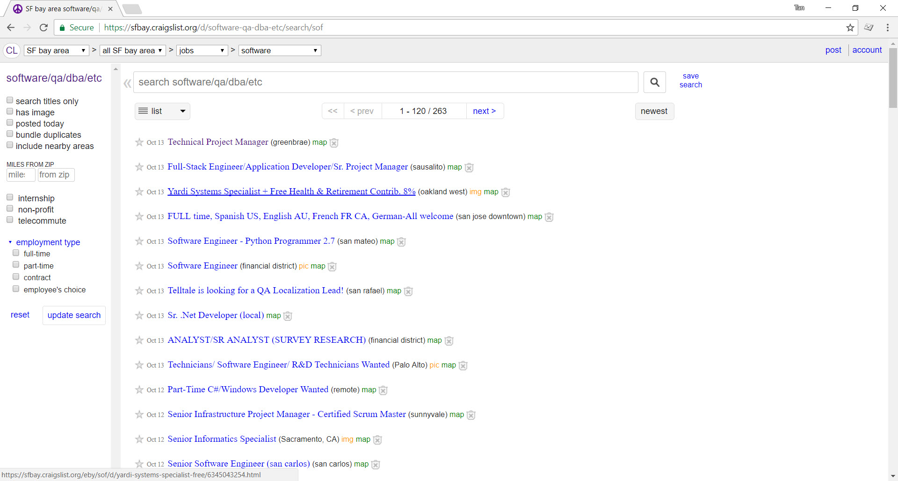

This tutorial will show up step by step how to using Scrapy frame work to scrape all software job which listed in sfbay.craigslist.com . And then store this data to csv or json file.
<!--more-->



### Create a new scrapy project

Open command prompt and typing in

```powershell
scrapy startproject 
```


### Understand scrapy project structure

### Create a new spider

### Understand spider file

### Debug extract content with scrapy shell

### Running spider

### Export scrape result to csv / json